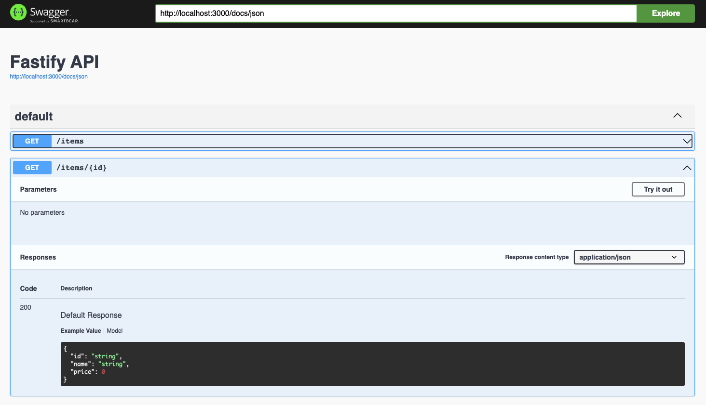

# Fastify Fundamentals Guide

<!-- TOC -->

- [Fastify Fundamentals Guide](#fastify-fundamentals-guide)
  - [Project Setup](#project-setup)
  - [Basic Server](#basic-server)
  - [Routing](#routing)
    - [Options and Validation Schemas](#options-and-validation-schemas)
    - [Handlers](#handlers)
  - [Controllers](#controllers)
  - [Swagger API Documentation](#swagger-api-documentation)

<!-- /TOC -->

**[Fastify](https://www.fastify.io/)** is a fast and low overhead web framework for Node.js. It's comparable to _Express_ and it is very similar in that it is very minimalist. However there are some advantages like a complete [ecosystem](https://www.fastify.io/ecosystem/) of plugins that are offered (`jwt`, `mongodb`, `swagger`,...).

> Using the `REST Client` extension for HTTP request in VSCode.
> <br><br>

## Project Setup

```bash
    $ npm init -y
    $ npm i fastify fastify-swagger uuid
    $ npm i -D nodemon
```

## Basic Server

```js
const fastify = require('fastify')({ logger: true });

const PORT = process.env.PORT || 3000;

const start = async () => {
  try {
    await fastify.listen(PORT);
  } catch (error) {
    fastify.log.error(err);
    process.exit(1);
  }
};

start();
```

## Routing

```js
fastify.get('/items/:id', (request, reply) => {
  const { id } = request.params;

  const item = items.find((item) => item.id === id);
  reply.send(item);
});
```

### Options and Validation Schemas

```js
{
  schema: {
    response: {
      200: {
        type: 'array',
        items: {
          type: 'object',
          properties: {
            id: { type: 'string' }, // if this is changed to 'integer' it will coerce it, e.g. '1' -> 1
            name: { type: 'string' }, // if this is commented out it won't be included in the HTTP response
          },
        },
      },
    },
  },
};
```

To avoid repeating yourself you can create an `Item schema` as follows:

```js
const Item = {
  type: 'object',
  properties: {
    id: { type: 'string' },
    name: { type: 'string' },
  },
};
```

### Handlers

The routes can be simplified with the handler included in the options:

```js
const getItemOptions = {
  schema: {
    response: {
      200: Item,
    },
  },
  handler: (request, reply) => {
    const { id } = request.params;

    const item = items.find((item) => item.id === id);
    reply.send(item);
  },
};

// Get item by id
fastify.get('/items/:id', getItemOptions);
```

## Controllers

The structure can be clean up with some controllers:

```js
// ./controllers/items.js
const getItem = (request, reply) => {
  const id = request.params.id;
  const item = items.find((item) => item.id === id);
  reply.send(item);
};

// ./routes/items.js
const getItemOptions = {
  schema: {
    response: {
      200: Item,
    },
  },
  handler: getItem,
};
```

## Swagger API Documentation

Once you have installed the `fastify-swagger` [plugin](https://github.com/fastify/fastify-swagger), during the [first step](#project-setup), **Fastify** will auto generate the `Swagger API Docs` with a very simple configuration:

```js
// ./server.js
fastify.register(require('fastify-swagger'), {
  exposeRoute: true,
  routePrefix: '/docs',
  swagger: {
    info: {
      title: 'Fastify API',
    },
  },
});
```

Now, if you go to `http://localhost:3000/docs` you should get something like:
<br><br>
